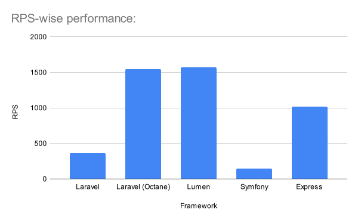
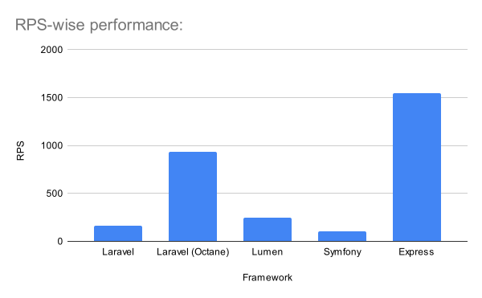
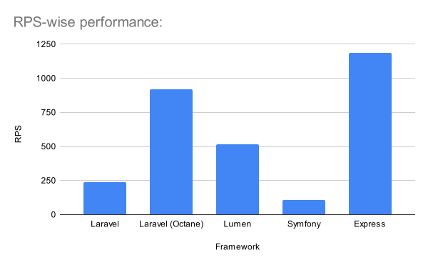
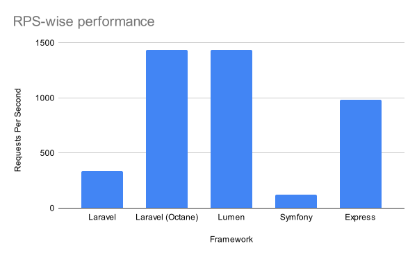

# Framework Benchmark

The goal of this repository is to benchmark popular frameworks to be used as a REST API in their optimal configuration. 

## Ideal Setup

- Default offering of the framework.
- Optimized suggested state for the framework.

## Testing Tool

- [ApacheBench](http://httpd.apache.org/docs/2.4/programs/ab.html)

## Testing Criteria

- **HelloWorld:** `GET /ping` : Returns a simple `{message: 'pong'}` JSON response.
    - Command: `ab -t 10 -c 10 http://server.address/ping`
- **Read:** `GET /users` : Returns a list of 50 users from the database.
    - Command: `ab -t 10 -c 10 http://server.address/users`
- **Write:** `POST /users` : Saves a user to the database.
    - Command: `ab -t 10 -c 10 -p data.json -T 'application/json' http://server.address/users`
- **Compute:** `GET /compute` : Computes the first 10,000 Fibonacci numbers.
    - Command: `ab -t 10 -c 10 http://server.address/compute`

## Frameworks

- [Laravel](./laravel) *(v8.54.0)*
- [Lumen](./lumen) *(v8.2.4)*
- [Symfony](./symfony) *(v5.3)*
- [Express](./expressjs) *(v4.17.1)*
- [Flight](./flight) *(v1.3)*

## System Requirements
- ApacheBench
- PHP 8.x or later
- Swoole PECL extension (for Laravel Octane)
- All of the projects are using SQLite to avoid heavy setup.

## Project Setup
- Laravel
    - Run `composer install`
    - Run `touch database/database.sqlite` from the `laravel` directory.
    - Run `cp .env.example .env` followed by `php artisan key:generate` from the `laravel` directory.
    - Open `.env` file and set the `DB_CONNECTION` variables value to `sqlite` and comment out all the remaining `DB_*` variables.
    - Run `php artisan migrate` from the `laravel` directory.
    - To run the project without octane, run: `php artisan serve`
    - To run the project with octane (make sure swoole pecl ext is installed and enabled): `php artisan octane:install` and then `php artisan octane:start`
- Lumen
    - Run `composer install`
    - Run `touch database/database.sqlite` from the `lumen` directory.
    - Run `cp .env.example .env` followed by `php artisan key:generate` from the `lumen` directory.
    - Open `.env` file and set the `DB_CONNECTION` variables value to `sqlite` and comment out all the remaining `DB_*` variables.
    - Run `php artisan migrate` from the `lumen` directory.
    - To run the project, run: `php -S localhost:8000 -t public`
- Symfony:
    - Run `composer install`
    - Run `touch var/data.db` from the `symfony` directory.
    - Create a `.env` file and set the `DATABASE_URL` to: `DATABASE_URL="sqlite:///%kernel.project_dir%/var/data.db"`
    - Run `php bin/console doctrine:migrations:migrate` and confirm if asked.
    - To run the project, run: `php -S localhost:8000 -t public`
- Express:
    - Run `touch database.sqlite` from the `expressjs` directory
    - Run: `npm install`
    - Run: `npm start`

Other than the above mentioned endpoints, each project has two helper endpoints: `/truncate` and `/generate` which truncates the `users` table and generates 50 user records with same key-value pairs to achieve byte-fairness across all frameworks. Performance isn't measured against these two endpoints.

The data.json file in each project is used during the test for the **Write** criteria.

## Results on Local Machine:
### Hardware:
    - Memory: 8GB Apple Unified Memory
    - CPU: 8-Core Apple Silicon

### **#1: Hello World:**
| Framework  | Request Per Second   |
|---|---|
| Laravel  | 366.19 |
| Laravel (Octane)  | 1548.85 |
| Lumen | 1567.74 |
| Symfony | 145.17 |
| Express | 1021.3 |

### **#2: Read:**
| Framework  | Request Per Second   |
|---|---|
| Laravel  | 159.39 |
| Laravel (Octane)  | 930.98 |
| Lumen | 246.95 |
| Symfony | 106.92 |
| Express | 1545.86 |

### **#3: Write:**
| Framework  | Request Per Second   |
|---|---|
| Laravel  | 238.62 |
| Laravel (Octane)  | 921.45 |
| Lumen | 513.8 |
| Symfony | 106.48 |
| Express | 1189.17 |

### **#4: Compute:**
| Framework  | Request Per Second   |
|---|---|
| Laravel  | 336.79 |
| Laravel (Octane)  | 1436.07 |
| Lumen | 1438.68 |
| Symfony | 122.29 |
| Express | 984.36 |

> *[P.S.: The results may be subject to change as we add more frameworks.]*
